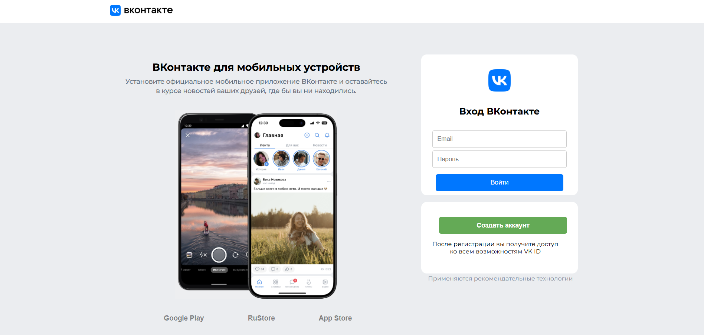
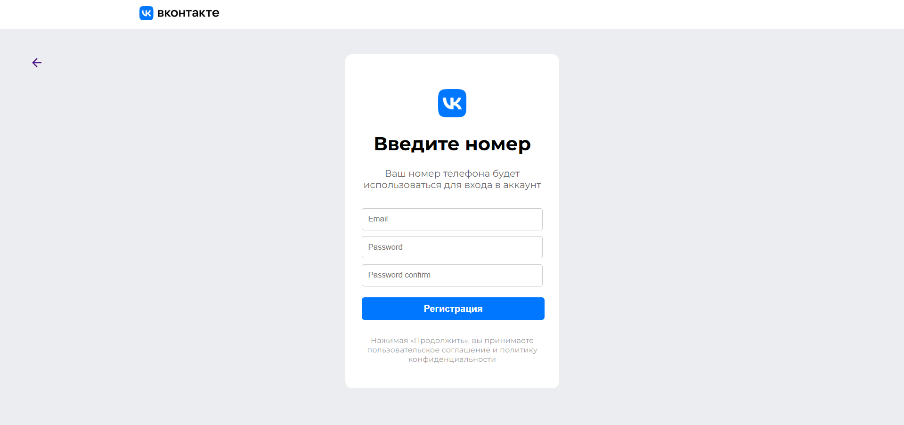
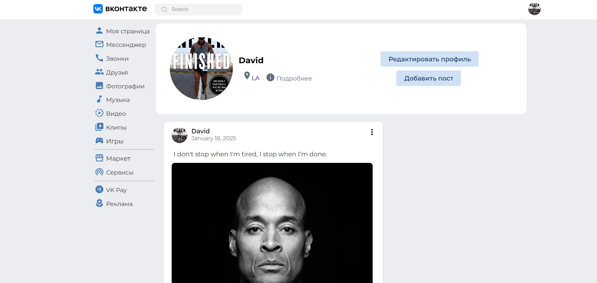
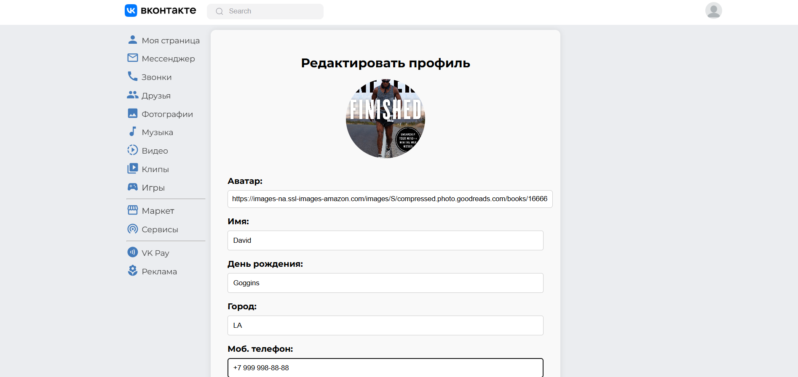
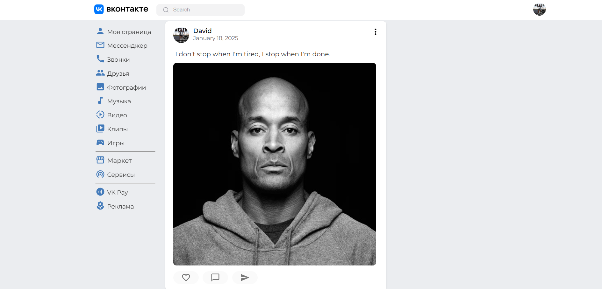
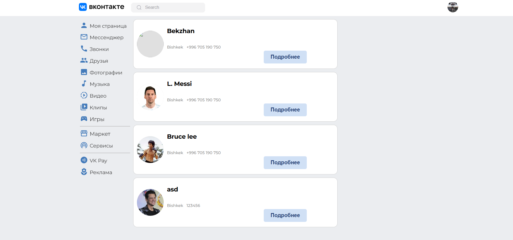

# VK Clone

A feature-rich clone of the popular VK social network built using modern web technologies. This project demonstrates my expertise in frontend development, state management, and API integration while replicating core VK functionalities.

### Login Page



### Register Page



### Main Page



### Profile



### Post



### Friends



## Features

### User Interface

- Responsive and visually appealing design using custom CSS and Module CSS.
- Optimized layout for various screen sizes and devices.

### State Management

- Efficient and scalable state management with Redux Toolkit.
- Centralized state logic for seamless data flow across components.

### TypeScript Integration

- Ensures type safety and improved code maintainability.
- Reduces runtime errors and enhances development efficiency.

### API Integration

- Axios for handling HTTP requests and data fetching.
- Uses JSON Server (db.json) for mock backend and local data storage.

### Custom Styling

- Handcrafted styles for a polished and modern look.
- Uses Module CSS for better component encapsulation.

## Technologies Used

- React
- Redux Toolkit
- TypeScript
- Axios
- Module CSS
- JSON Server (db.json)

## How to Run the Project

1. **Clone the Repository:**

   ```sh
   git clone https://github.com/YourUsername/YourRepository.git
   ```

2. **Navigate to the Project Directory:**

   ```sh
   cd YourRepository
   ```

3. **Install Dependencies:**

   ```sh
   npm install
   ```

4. **Start the JSON Server:**

   ```sh
   npx json-server --watch db.json --port 5000
   ```

5. **Run the Development Server:**
   ```sh
   npm start
   ```

The application will be available at [http://localhost:3000/](http://localhost:3000/), and the mock backend will be available at [http://localhost:5000/](http://localhost:5000/).

## Screenshots

(Add screenshots of your project here, including images of the login page, profile page, feed, etc.)

## Challenges Faced

- Ensuring type safety with TypeScript while working on dynamic components.
- Managing complex state logic efficiently with Redux Toolkit.
- Implementing responsive design across various screen sizes.
- Simulating backend behavior using JSON Server.

## Future Improvements

- Full backend integration for real-time data updates (e.g., Firebase, Node.js).
- Enhancing user experience with animations and transitions.
- Implementing advanced features such as messaging, notifications, and media uploads.
- Adding dark mode and accessibility improvements.

## Contact

Feel free to reach out if you have any questions or feedback:

- **Email:** r.alisherovdev@gmail.com
- **GitHub:** [Alisherov017](https://github.com/Alisherov017)

---

_This project is for educational and portfolio purposes and is not affiliated with VK._
